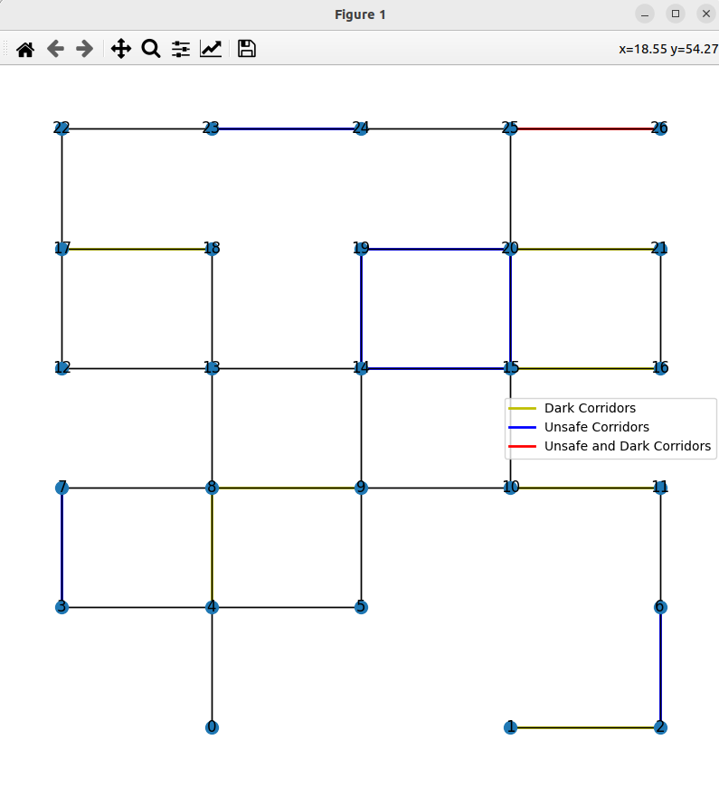

# navigation_pddl_tomasys

PDDL-TOMASys ontology for a navigation scenario

## Docker

Build:
```bash
docker build -t pddl_tomasys .
```

Run:
```bash
docker run --rm -it -v $HOME/navigation_pddl_tomasys_ws/src/navigation_pddl_tomasys/results:/navigation_pddl_tomasys/results pddl_tomasys:latest python scripts/runner.py
```

## Install

Install deps:
```
pip install networkx
pip install numpy==1.26.4
pip install matplotlib
pip install scipy
```

Install [Unified Planning](https://unified-planning.readthedocs.io/en/latest/getting_started/installation.html):

```bash
pip install unified-planning
```
Install fast-downward unified planning engine:

```bash
pip install unified-planning[fast-downward]
```

## Build

```bash
colcon build --symlink-install --packages-skip plansys2_downward_planner
```

## Generate random maps and test with fast-downard

In the main folder
```bash
python scripts/map_generator.py
ros2 run downward_ros fast-downward.py --alias lama-first pddl/domain.pddl pddl/problem.pddl
```

## Convert OWL ontology to PDDL

Normal version:

```
export PATH=$HOME/navigation_pddl_tomasys_ws/src/owl_to_pddl:$PATH
```

```bash
OWLToPDDL.sh --owl=owl/navigation.owl --tBox --inDomain=pddl/domain_sas.pddl --outDomain=pddl/domain_sas_created.pddl --aBox --inProblem=pddl/problem.pddl --outProblem=pddl/problem_created.pddl --replace-output --add-num-comparisons
```

ROS version:
```bash
ros2 run owl_to_pddl owl_to_pddl.py --ros-args -p owl_file:=owl/navigation.owl -p in_domain_file:=pddl/domain_sas.pddl -p out_domain_file:=pddl/domain_sas_created.pddl -p in_problem_file:=pddl/problem.pddl -p out_problem_file:=pddl/problem_created.pddl
```

## Run fast-downward solver

```
export PATH=$HOME/navigation_pddl_tomasys_ws/src/downward:$PATH
```

```
fast-downward.py  pddl/domain_sas_created.pddl pddl/problem_created.pddl --search "astar(blind())"
```

```bash
ros2 run downward_ros fast-downward.py --alias lama-first pddl/domain_sas_created.pddl pddl/problem_created.pddl
```

## Example of results

Parameters:

```python
self.num_nodes = 30
self.nodes_skip = 0.1 # 10%
self.unconnected_amount = 0.15 # 10%
self.unsafe_amount = 0.25 # 10%
self.dark_amount = 0.25 # 10%
```

time:
```bash
Solution found.
Peak memory: 45500 KB
Remove intermediate file output.sas
search exit code: 0

INFO     Planner time: 0.15s

real	0m0,325s
user	0m0,270s
sys	0m0,054s
```

Parameters:
```python
self.num_nodes = 300
self.nodes_skip = 0.1 # 10%
self.unconnected_amount = 0.15 # 10%
self.unsafe_amount = 0.25 # 10%
self.dark_amount = 0.25 # 10%
```

time:
```bash
Solution found.
Peak memory: 50856 KB
Remove intermediate file output.sas
search exit code: 0

INFO     Planner time: 8.33s

real	0m8,517s
user	0m8,230s
sys	0m0,287s
```

## Map example


