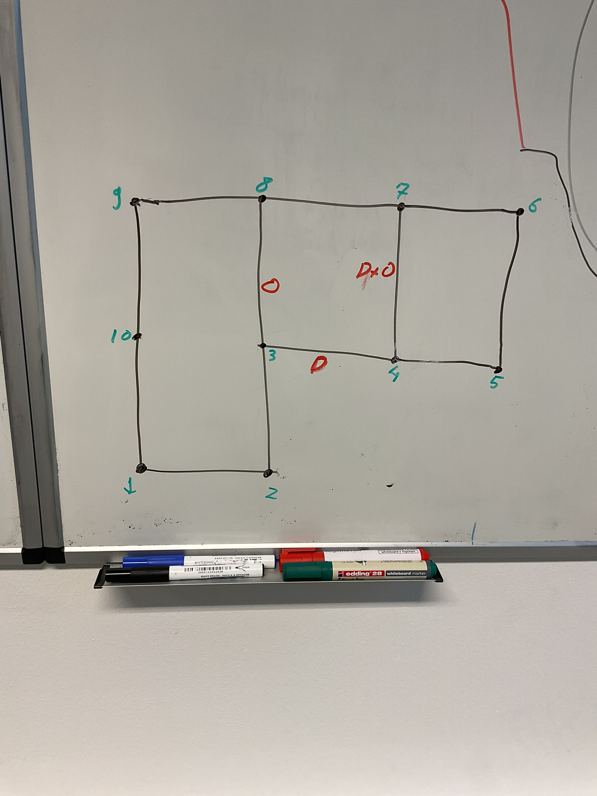

# navigation_pddl_tomasys

PDDL-TOMASys ontology for a navigation scenario

## Install

Install deps:
```
pip install networkx
pip install numpy==1.26.4
pip install matplotlib
pip install scipy
```

Install [Unified Planning](https://unified-planning.readthedocs.io/en/latest/getting_started/installation.html)

Install fast-downward unified planning engine:

```bash
pip install unified-planning[fast-downward]
```

## Build

```bash
colcon build --symlink-install --packages-skip plansys2_downward_planner
```

## Generate random maps

In the scripts folder
```bash
python map_generator.py
```

## Convert OWL ontology to PDDL

```bash
ros2 run owl_to_pddl owl_to_pddl.py --ros-args -p owl_file:=owl/navigation.owl -p in_domain_file:=pddl/domain_sas.pddl -p out_domain_file:=pddl/domain_sas_created.pddl -p in_problem_file:=pddl/problem.pddl -p out_problem_file:=pddl/problem_created.pddl
```

## Run fast-downward solver

```bash
ros2 run downward_ros fast-downward.py --alias lama-first pddl/domain_sas_created.pddl pddl/problem_created.pddl
```

